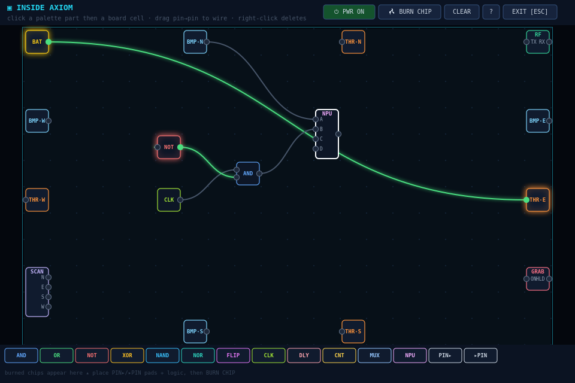
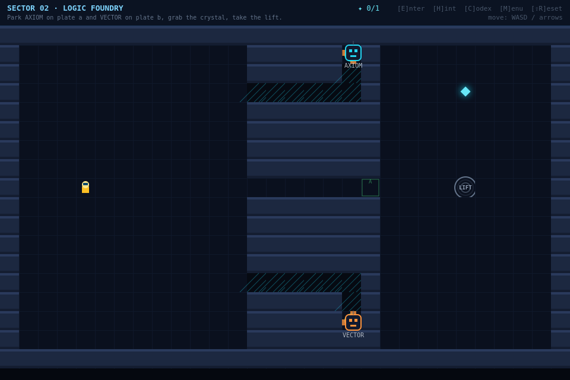
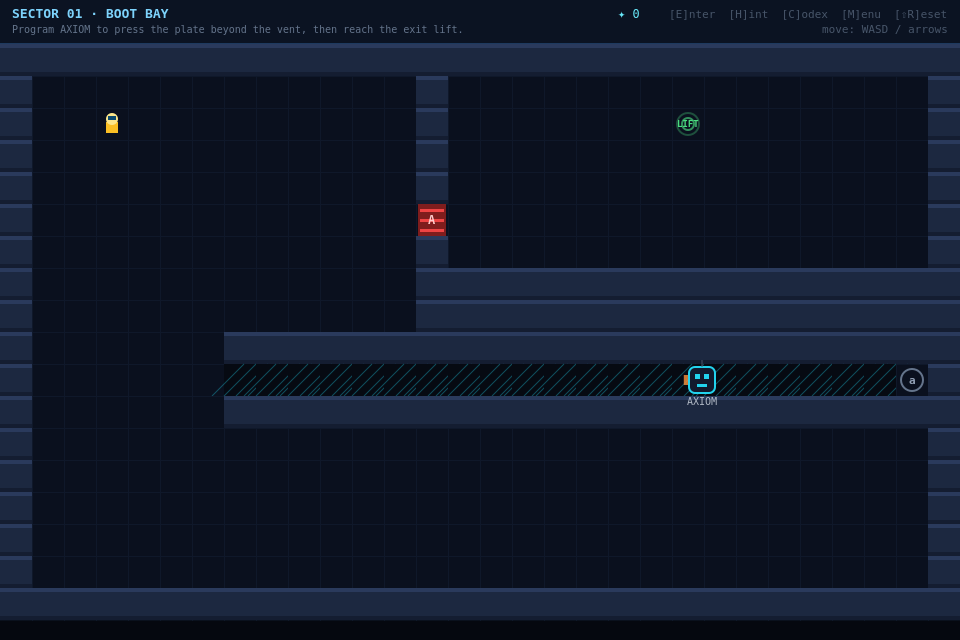
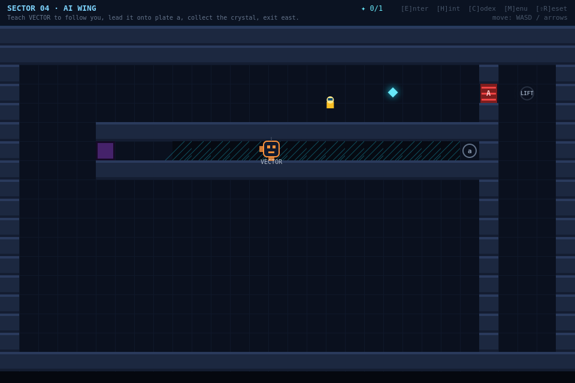

# Robot Odyssey 2K

A modern browser reimagining of the classic **Robot Odyssey** (Apple II, 1984) —
the game that taught a generation of engineers digital logic by letting them
climb inside robots and wire them up.

You are an engineer sealed inside the sub-levels of the **Helios Semiconductor
megafab** during an emergency lockdown. Robots can go where you can't — through
service vents, onto pressure plates, past hazards — but they only do what their
circuits tell them. Step inside, solder logic between their sensors and motors,
and escape sector by sector.


| | |
|---|---|
|  |  |
| *the live circuit bench inside a robot* | *Sector 02: two robots vs. an AND interlock* |
|  |  |
| *Sector 01: AXIOM drives the service vent* | *Sector 04: a scanner→thruster follow policy* |

## Play

```bash
npm start          # → http://localhost:8080
```

…or serve the folder with any static file server (`python3 -m http.server`,
GitHub Pages, etc.). No build step, no dependencies — vanilla ES modules +
Canvas.

## What's inside

### Classic Robot Odyssey DNA
- **Enter robots and wire them live** — the world keeps simulating while you solder.
- Bumpers, thrusters, a grabber claw, batteries, and glowing hot wires.
- **Chip burning**: place `PIN▸`/`▸PIN` pads around logic and hit **BURN CHIP** —
  your circuit becomes a reusable IC (chips can nest inside chips).
- Multi-robot puzzles, pressure-plate interlocks, keycards, robot-only vents.

### Modern upgrades
- **Semiconductor era parts**: NAND/NOR/XOR, SR flip-flops (SRAM cells), clocks,
  delay lines (propagation delay as a *feature*), 4-bit counters, multiplexers.
- **NPU part — a real perceptron**: per-input weights (−1/0/+1) and a firing
  threshold, the atom of every modern AI accelerator.
- **Humanoid-robotics sensors**: a sensor-fusion scanner (camera + lidar) that
  tracks targets, and radio antennas with channels for robot-to-robot comms —
  wire scanner→thrusters and you've written a follow policy.
- **The Engineer's Codex** (press `C`): field notes on MOSFETs, CMOS, Moore's
  law and the 2 nm GAA era, EUV lithography, tapeout, SRAM, perceptrons,
  AI accelerators, and modern humanoid robots.
- Unit-delay gate simulation — ring oscillators, latches and clocked state
  machines behave like real silicon.

### The campaign
| Sector | Teaches |
|---|---|
| 01 · Boot Bay | entering robots, wiring power to motors |
| 02 · Logic Foundry | bumper feedback, AND-interlocked doors, two robots |
| 03 · Cleanroom Loop | flip-flop memory, the grabber, autonomous round trips |
| 04 · AI Wing | scanner sensor fusion, follow policies, EMP fields |
| 05 · Tapeout | a two-stage pipeline combining everything |

Plus an **Innovation Lab** sandbox with all three robots and zero objectives.

## Controls

| key | action |
|---|---|
| WASD / arrows | walk |
| `E` | enter the robot you're standing on |
| `ESC` | leave the robot / close dialogs |
| `H` | cycle puzzle hints |
| `C` | Engineer's Codex |
| `shift+R` | reset the sector (keeps your wiring) |
| `M` | main menu |

Inside a robot: click a palette part → click the board to place it; drag from an
output pin to an input pin to wire; right-click deletes; select a CLK/DLY/RF/NPU
part to tune it. Progress, circuits and burned chips autosave to localStorage.

## Development

```bash
npm test    # 34 headless tests: gate semantics, chip fab round-trips,
            # map integrity, full end-to-end solvability simulations of
            # every campaign sector (robots actually drive the mazes),
            # and a DOM-stub boot/interaction smoke test

# regenerate the README screenshots (renders the real game via node-canvas):
npm i --no-save canvas && node scripts/screenshot.mjs
```

Pushes to `main` deploy to GitHub Pages automatically (enable Pages with
source "GitHub Actions" in the repo settings); CI runs the test suite on
every push.

The circuit core (`src/circuit.js`) and world simulation (`src/world.js`) are
DOM-free, so the entire game logic runs under plain Node.

| module | role |
|---|---|
| `src/circuit.js` | parts, wires, unit-delay simulation, (de)serialization |
| `src/chips.js` | tapeout: burn boards into nested IC blueprints |
| `src/robot.js` | robot body + peripheral board, physics, grabber |
| `src/world.js` | tiles, doors/plates, items, radio spectrum, player |
| `src/levels.js` | campaign + sandbox data (ASCII maps) |
| `src/editor.js` | the in-robot circuit bench |
| `src/render.js` / `src/ui.js` | canvas renderer, DOM overlays |
| `src/codex.js` | real-world tech notes |
